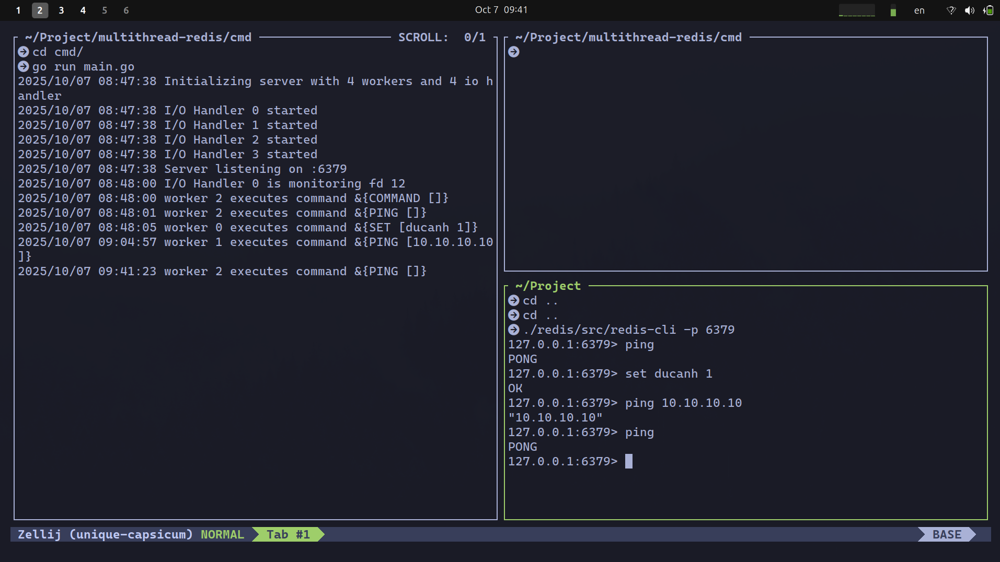

<h1 align="center">RediGo</h1>
<p align="center">
    
</p>
<p align="center">
     A Redis-like in-memory datastore built in Go, with focus on concurrency, caching
</p>

<a name="table-of-contents"></a>

## Table of contents

- [Table of contents](#table-of-contents)
- [Description](#description)
- [Installation](#installation)
  - [Requirements](#requirements)
  - [Clone the project](#clone-the-project)
  - [Build from source](#build-from-source)
- [Features](#features)
- [Usage](#usage)
  - [Run the server locally](#run-the-server-locally)
  - [Connect with redis-cli](#connect-with-redis-cli-or-any-resp-compatible-client)
- [Config](#config)
- [TODO](#todo)
- [License](#license)

<a name="description"></a>

## Description

This project is a from-scratch implementation of a Redis-like in-memory data store written in Go, focusing on system design, concurrency, and performance optimization.



<a name="installation"></a>

## Installation

<a name="requirements"></a>

### Requirements

- Go 1.22+
- (Optional) Docker or Podman for containerized deployment

<a name="clone-the-project"></a>

### Clone the project

```bash
git clone https://github.com/spaghetti-lover/RediGo.git
```

<a name="build-from-source"></a>

### Build from source

```bash
# Build binary for your platform
make build

# Build for all major platforms
make build-all
```

<a name="features"></a>

## Features

Key features explored and implemented throughout the project:

1. ⚡ Networking: TCP server, I/O multiplexing (`epoll`, `kqueue`)
2. 🔗 Protocol: Redis Serialization Protocol (RESP)
3. 🛠️ Core Commands: `GET`, `SET`, `TTL`, `DEL`, auto key expiration
4. 🔑 Set Operations: `SADD`, `SREM`, `SCARD`, `SMEMBERS`, `SISMEMBER`, `SRAND`, `SPOP`
5. 📊 Probabilistic Data Structures: Count-Min Sketch, Bloom Filter
6. 🧹 Caching: Eviction strategies with approximated LRU algorithm
7. 🧵 Concurrency Model: Shared-nothing architecture, thread-per-shard design

This repository demonstrates not only how Redis works internally but also how to design scalable, concurrent, and efficient distributed systems.

<a name="usage"></a>

## Usage

<a name="run-the-server-locally"></a>

### Run the server locally

```bash
./redis-server
```

<a name="connect-with-redis-cli-or-any-resp-compatible-client"></a>

### Connect with redis-cli or any RESP-compatible client

```bash
redis-cli -p 6379
```

Example:

```bash
SET key "Hello"
GET key
```

<a name="config"></a>

## Config

| Argument            | Description                                    | Default |
| ------------------- | ---------------------------------------------- | ------- |
| `--port`            | Port to run the Redis server on                | `6379`  |
| `--shards`          | Number of shards (thread-per-shard model)      | `4`     |
| `--max-memory`      | Maximum memory before eviction starts          | `256MB` |
| `--eviction-policy` | Eviction policy (`approx-lru`, `random`, etc.) | `lru`   |

<a name="todo"></a>

## TODO

- [x] Implement RESP parser
- [x] Basic commands (`GET`, `SET`, `DEL`, `TTL`)
- [x] Set operations (`SADD`, `SREM`, …)
- [x] Count-Min Sketch
- [x] Bloom Filter
- [x] Approximated LRU
- [ ] Implement EXPIRE, DEL, EXISTS command
- [ ] Cluster mode (multi-node)
- [ ] Persistence (RDB / AOF)
- [ ] Pub/Sub

<a name="license"></a>

## License

[MIT](https://choosealicense.com/licenses/mit/)
