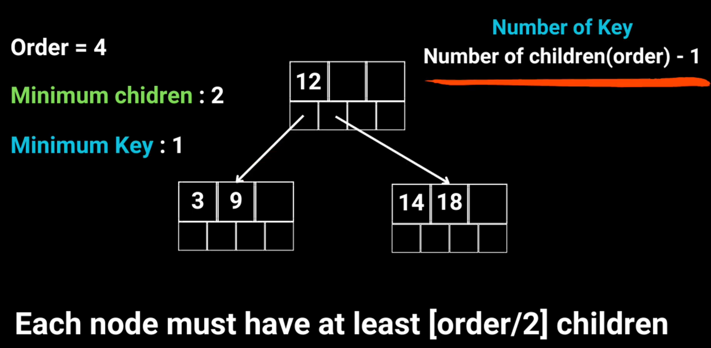
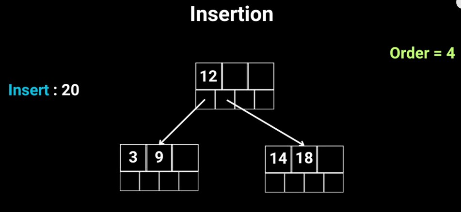
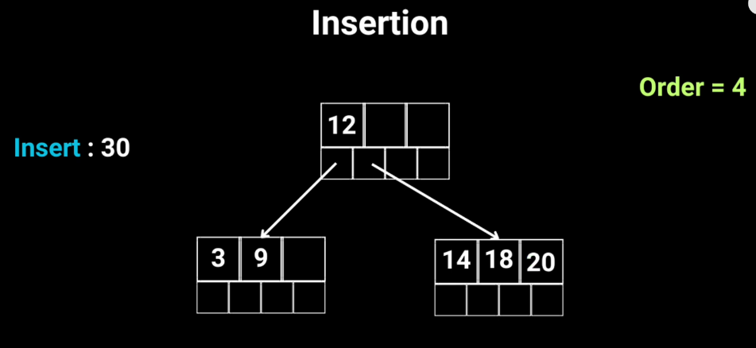
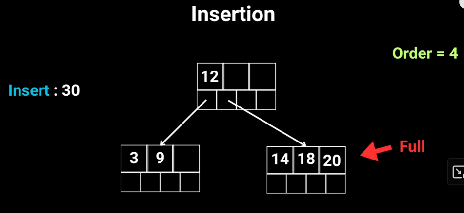
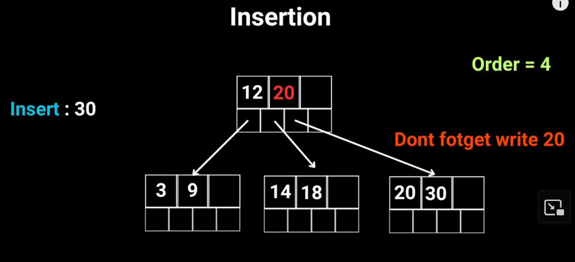
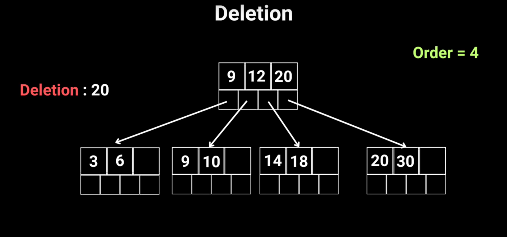
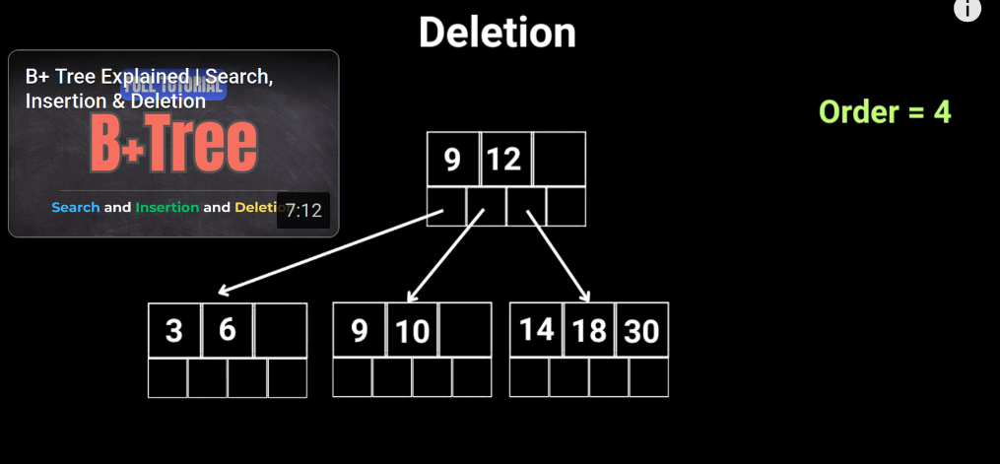

# B+ Tree

## What

Self-balancing data structure that maintains sorted data. What this: https://www.youtube.com/watch?v=c8YdjrnyKvc

## Why

- Redis default use Hash Table (dict) for key-value store -> lookup only cost O(1). However, it don't support range query effectively (have to scan entirely)

Redis need to do operations like `range scan`, `ORDER BY`, `BETWEEN`, `prefix search`,... that hash table

### Pros

- **Low height**: Each node have high order. Height of B+ Tree is sallow, thus minimize disk access.
- **All data sorted in leaves**: Leaf nodes are linked together in a list. Enables fast range scan (for example, retrieving all key within [a, b])
- **Automatic balancing on updates**: Insert and delete operations rebalance the tree automatically. Queries always run in O(log n)
- **Optimized for disk and memory blocks**: Node sizes are typically aligned with page or block sizes (for example, 4 KB). Maximizes locality when loading from disk or cache.
- **Lower memory overhead**: Use less memory than Skip List (e.g. DragonFly use)

### Cons

- **Higher update cost compared to hash tables**: Insert and delete operations may require splitting or merging nodes.
- **Slower exact key lookup compared to hash tables**: Hash table lookups run in O(1), while B+ trees require O(log n).
- **Extra memory usage**: Nodes must store multiple pointers, which increases overhead.

## How


Rule:

- Number of key = number of children - 1
- Each node must have at least [order / 2] children

- Insertion:

  - Normatl Insert:

    - Before:
      
    - After:
      

  - Insert when node is full (except root)

    - Before:
      
    - After:
      

  - Insert when root is full
    - Before:
    ```less
                    [ 9 | 12 | 20 ]
               /      |      |       \
        [3, 6]   [9, 10]  [14, 18]  [20, 30, 40]
    ```
    - After:
    ```less
                      [ 20 ]
                   /        \
             [ 9 | 12 ]     [ 40 ]
            /    |    \     /     \
      [3,6] [9,10] [14,18] [20,30] [40,50]
    ```

- Deletion:

  - Before:
    

  - After:
    
